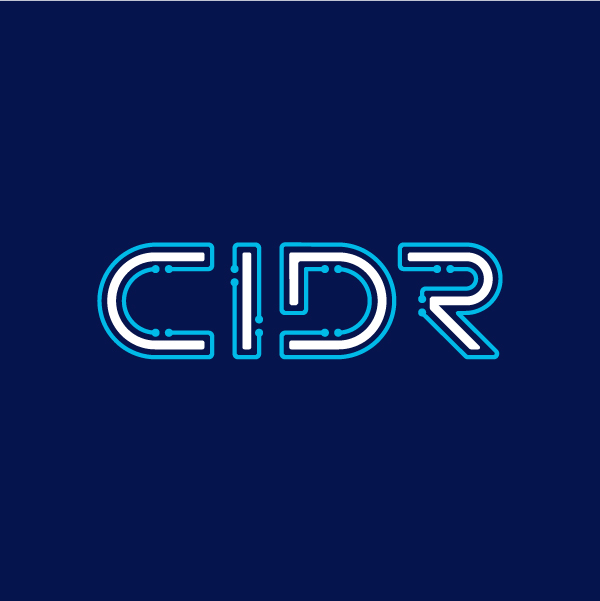

### Cisco's US Public Sector Developer Community

## Supported BY:
 A community of Public Sector SAs defined by their values

## Cisco's CIDR Values:
   Community, Integrity, Disruption, Relevance

## Vision:
   To Facilitate a robust NetDevOps community
   
[The Dets](https://ciscops.github.io/cidr/presentations/overview.html#/)
